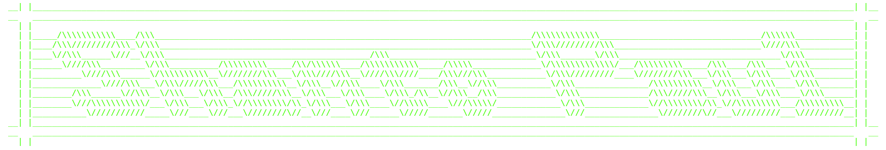

Hello there 👋 I'm Shanto, Fullstack developer from <strong>Dhaka</strong>, <strong>Bangladesh</strong>. I've completed <a href="https://www.programming-hero.com">Programming Hero</a>'s <a href="https://web.programming-hero.com/home">Complete Web Development</a> course earlier this year. I'm currently working on <a href="https://www.frontendmentor.io/profile/shantoopaul">Frontend Mentor Challenges</a> to improve my frontend skills and explore new technologies. As a sidequest, I'm learning how to work with Linux at <a href="https://labex.io/users/shanto-paul-66614890">Labex</a>.

<a href="mailto:shantoopaul@gmail.com"><code>E-mail</code></a> •
<a href="https://x.com/shan_t0"><code>X (Twitter)</code></a> •
<a href="https://www.linkedin.com/in/shantoopaul/"><code>LinkedIn</code></a> •
<a href="https://bsky.app/profile/shantopaul.bsky.social"><code>Bluesky</code></a>

