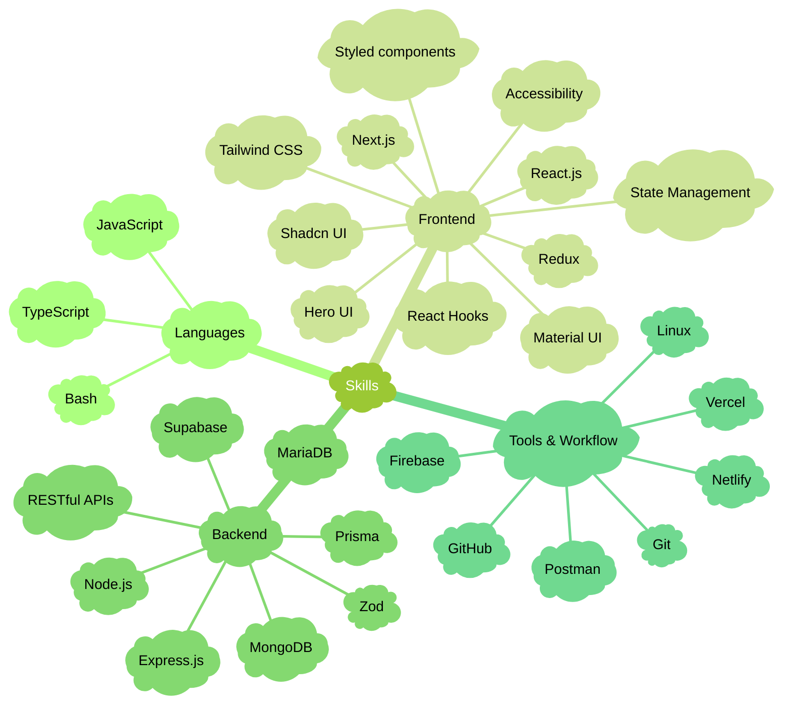

  

  <a href="mailto:shantoopaul@gmail.com"><code>E-mail</code></a> •
  <a href="https://x.com/shan_t0"><code>X (Twitter)</code></a> •
  <a href="https://www.linkedin.com/in/shantoopaul/"><code>LinkedIn</code></a> •
  <a href="https://bsky.app/profile/shantopaul.bsky.social"><code>Bluesky</code></a>

Hey there 👋 I'm <strong>Shanto</strong>, Fullstack Developer from <strong>Dhaka, Bangladesh</strong>.  
I recently completed the <a href="https://www.programming-hero.com">Programming Hero</a>
<a href="https://web.programming-hero.com/home">Complete Web Development</a> course earlier this year.  
Right now, I'm working on <a href="https://www.frontendmentor.io/profile/shantoopaul">Frontend Mentor challenges</a> to improve my frontend skills as well as exploring new technologies.  
As a sidequest, I'm also learning how to use Linux 🐧 at <a href="https://labex.io/users/shanto-paul-66614890">Labex</a>.

  
   
  <small>Languages used in my repos - big fan of JavaScript 😄</small>
    

<h3>🗺️ My Dev Journey (Skill Map)</h3>

<!-- https://mermaid.js.org/ -->

```mermaid
---
config:
  theme: 'forest'
---
mindmap
    root)Skills(
        )Languages(
            )JavaScript(
            )TypeScript(
            )Bash(
        )Frontend(
            )React.js(
            )Next.js(
            )Redux(
            )React Hooks(
            )State Management(
            )Tailwind CSS(
            )Material UI(
            )Styled components(
            )Shadcn UI(            
            )Hero UI(
            )Accessibility(
        )Backend(
            )Node.js(
            )Express.js(
            )Zod(
            )Prisma(
            )MongoDB(
            )MariaDB(
            )Supabase(
            )RESTful APIs(
        )Tools & Workflow(
            )Git(
            )GitHub(
            )Postman(
            )Vercel(
            )Netlify(
            )Firebase(
            )Linux(
```

<!-- I'm not done with it yet. Will come back later someday again :)-->
