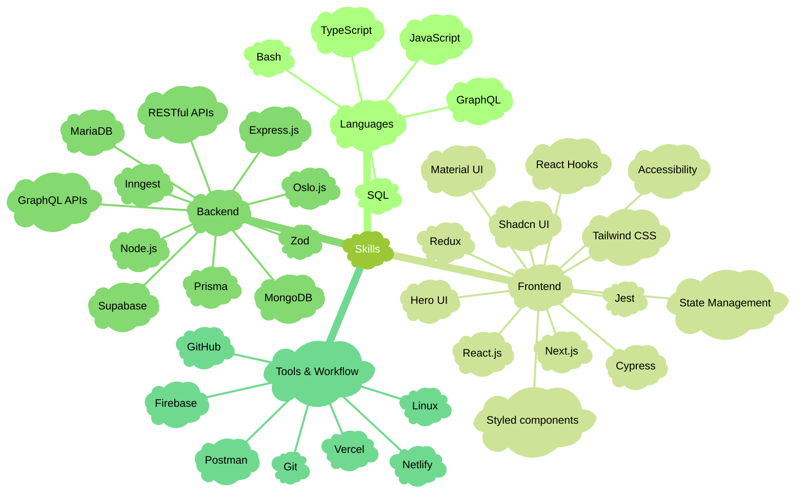

  

  <a href="mailto:shantoopaul@gmail.com"><code>E-mail</code></a> •
  <a href="https://x.com/shan_t0"><code>X (Twitter)</code></a> •
  <a href="https://www.linkedin.com/in/shantoopaul/"><code>LinkedIn</code></a> •
  <a href="https://bsky.app/profile/shantopaul.bsky.social"><code>Bluesky</code></a>

Hey there 👋 I'm <strong>Shanto</strong>, Fullstack Developer from <strong>Dhaka, Bangladesh</strong>.  
I recently completed the <a href="https://www.programming-hero.com">Programming Hero</a> 
<a href="https://web.programming-hero.com/home">Complete Web Development</a> course earlier this year.  
Right now, I'm working on <a href="https://www.frontendmentor.io/profile/shantoopaul">Frontend Mentor challenges</a> to improve my frontend skills as well as exploring new technologies.  
As a sidequest, I'm also learning how to use Linux 🐧 at <a href="https://labex.io/users/shanto-paul-66614890">Labex</a>.

  
   
  <small>Languages used in my repos - big fan of JavaScript 😄</small>
    

[//]: # (https://mermaid.js.org/)
